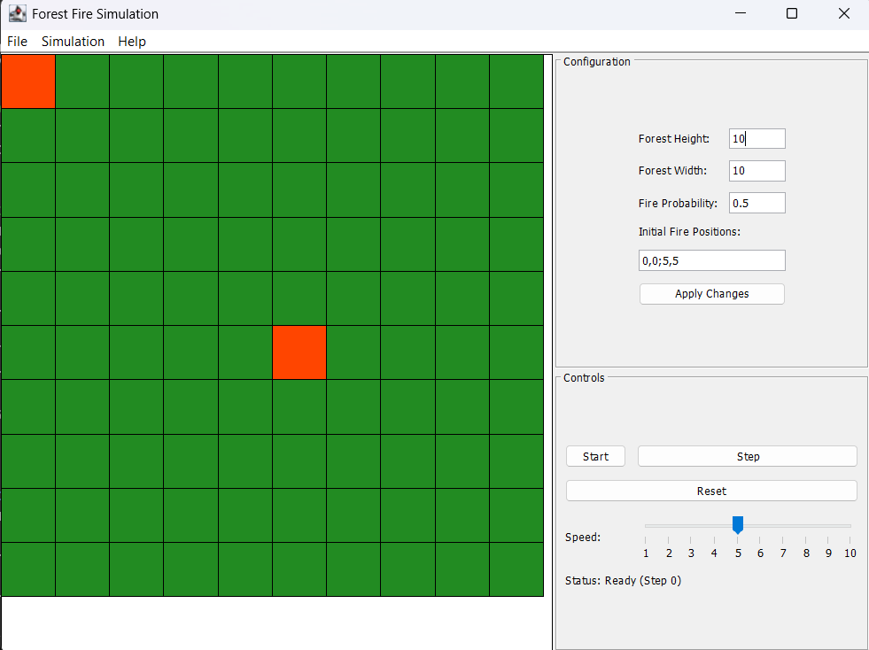

# Forest Fire Simulation

A Java application that simulates the propagation of fire through a forest grid.

## Overview

This simulation models how fire spreads through a forest over discrete time steps. The forest is represented as a grid of cells, where each cell can be in one of three states:
- Tree (T): A healthy tree that can catch fire
- Fire (F): A burning tree
- Ash (A): The remains after a tree has burned

## Simulation Rules

The simulation follows these rules:
1. If a cell is on fire at step t, it becomes ash at step t+1
2. Fire has a probability p of spreading to each of the 4 adjacent cells (up, right, down, left)
3. The simulation ends when no cells are on fire

## Features

- Configurable forest grid dimensions
- Configurable fire propagation probability
- Support for multiple initial fire positions
- Step-by-step simulation execution
- Command-line interface for interaction
- Graphical user interface for visual simulation

## GUI Screenshot



*The GUI shows a 10x10 forest grid with trees (green), fire (red), and configuration options for forest dimensions, fire probability, and initial positions. Control buttons allow starting, stepping through, and resetting the simulation.*

## Getting Started

### Prerequisites

- Java JDK 8 or higher
- Maven 3.6 or higher

### Building the Project

```bash
cd backend/forest-fire-simulation
mvn clean compile
```

### Running the Simulation

#### Option 1: Using Command Line (All Platforms)

```bash
cd backend/forest-fire-simulation
mvn exec:java "-Dexec.mainClass=com.forestfire.App"
```

#### Option 2: Using Batch File (Windows)

For Windows users who aren't familiar with command-line interfaces, a batch file is provided for easier execution:

1. Place the `run-forest-fire-simulation.bat` file in the root directory of the project (same level as the "backend" folder)
2. Double-click the batch file to run the simulation
3. The batch file will:
   - Navigate to the correct directory
   - Build the project automatically
   - Run the simulation
   - Keep the window open until you press a key

#### Option 3: Running the GUI Version

The simulation includes a graphical user interface that provides a visual representation of the forest fire simulation.

##### Using the GUI Batch File (Windows)

1. Place the `run-forest-fire-simulation-gui.bat` file in the root directory of the project (same level as the "backend" folder)
2. Double-click the batch file to run the simulation in GUI mode
3. The batch file will:
   - Navigate to the correct directory
   - Build the project automatically
   - Run the simulation in GUI mode
   - Keep the window open until you press a key

##### Using PowerShell or Command Prompt

To run the GUI version using PowerShell or command prompt:

```bash
cd backend/forest-fire-simulation
mvn exec:java "-Dexec.mainClass=com.forestfire.App" "-Dexec.args=--gui"
```

The `--gui` argument tells the application to start in graphical mode instead of command-line mode.

##### GUI Features

Once the GUI starts, you'll see:
- A visual grid representing the forest (green for trees, red for fire, gray for ash)
- Control buttons (Start, Stop, Step, Reset)
- A speed slider to control simulation pace
- Configuration panel to adjust forest dimensions, fire probability, and initial positions

## Configuration

The simulation parameters can be modified in the configuration file:

```
config/simulation.properties
```

Parameters include:
- `forest.height`: Height of the forest grid
- `forest.width`: Width of the forest grid
- `fire.propagation.probability`: Probability of fire spreading to adjacent cells
- `fire.initial.positions`: Initial positions of fire cells (format: row1,col1;row2,col2;...)

These parameters can also be modified through the GUI configuration panel.

## Usage

### Command-Line Interface

Once the command-line application is running, you'll be presented with a menu of options:
1. Run single step - Advances the simulation by one step
2. Run to completion - Runs the simulation until no more cells are burning
3. Reset simulation - Resets the forest to its initial state
4. Exit - Exits the application

### Graphical User Interface

The GUI provides the following controls:
- Start/Stop button - Starts or stops the automatic simulation
- Step button - Advances the simulation by one step
- Reset button - Resets the forest to its initial state
- Speed slider - Controls how fast the simulation runs
- Apply Changes button - Updates the simulation with new configuration values

## Project Structure

- `model/`: Contains the core domain classes (Cell, Forest)
- `config/`: Contains configuration handling classes
- `service/`: Contains the simulation logic
- `controller/`: Contains the user interface logic
- `gui/`: Contains the graphical user interface components
- `config/`: Contains configuration files

## License

This project is licensed under the MIT License - see the LICENSE file for details.